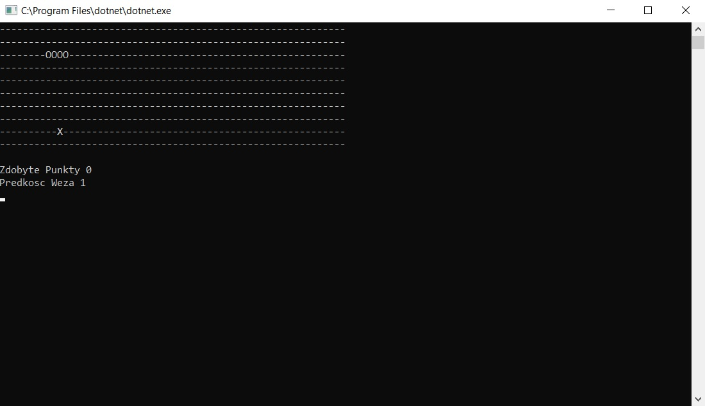
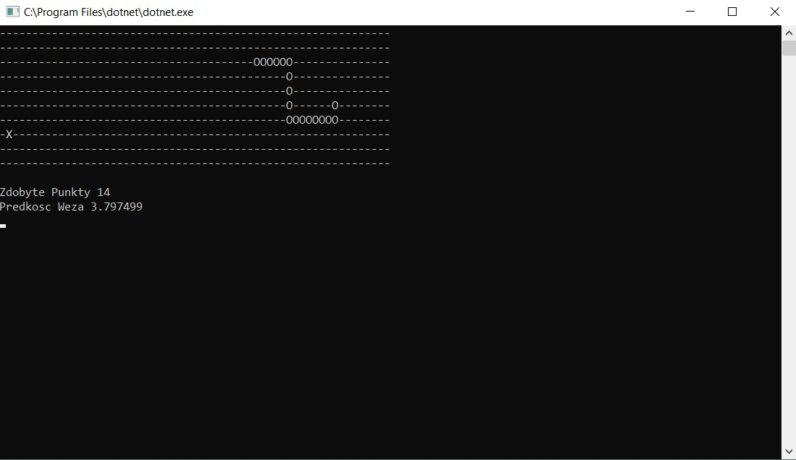

# Wprowadzenie
Aplikacja Snake jest to konsolowa gra typu wąż, w której celem gracza jest uzyskanie najdłuższego węża, co wiąże się ze stopniowym wzrostem poziomu trudności gry. Gra się kończy w momencie ugryzienia własnego ogona lub uderzenia w krawędź planszy. Długość węża zwiększana jest za każdym razem, gdy gracz zdobędzie pożywienie. Aby gra nabierała coraz większej dynamiki - za każdym razem, gdy wąż sterowany przez gracza się wydłuża - zwiększa się także prędkość poruszania o 10%. Gracz steruje kierunkiem poruszania się węża za pomocą klawiszy strzałek na klawiaturze.

# Architektura

Aplikacja została napisana w języku C# z wykorzystaniem oprogramowania Visual Studio i wykorzystyje niektóre klasy z biblioteki standardowej C# takie jak:
- System.Collections - do obsługi list
- System.Drawing - do geometrii 2D
- System.Linq - do zapytań na listach

W kodzie źródłowym zdefiniowane są klasy pomocnicze obsługujące różne aspekty gry takie jak rysowanie planszy, obsługa przyrostu ogona węża czy zliczanie zdobytych punktów.

Aplikacja zawiera główną pętlę gry, która w każdym kroku pobiera wejście od użytkownika (naciśnięcia klawiatury), oblicza ruch węża oraz wyświetla zaktualizowany stan gry na konsoli.

# Klasy i metody

## Klasa Punkt
Klasa Punkt reprezentuje zdobywanie pożywienia, a co za tym idzie, ilość punktów zdobytych przez gracza. Pole *startPoint* inicjalizowane jest punktem o współrzędnych (6,6).

### Pola
    int IleRazyPowstal;     // jak dużo razy było generowane nowe pożywienie
    int xx;                 // współrzędna x
    int xy;                 // współrzędna y
    Point startPoint;       // punkt startowy
    Boolean Jest;           // określa, czy istnieje pożywienie na planszy

### Metody
    void NowaPunktacja();       // resetuje punktacje (IleRazyPowstal)
    void RysujeKolejnyPunkt();  // losuje współrzędne kolejnego pożywienia na mapie
    Boolean Contains(Point p);  // sprawdza, czy podany punkt ma takie same współrzędne jak pożywienie

## Klasa GamePanel
Klasa reprezentuje planszę do gry w węża. Pole *area* inicjalizowane jest prostokątną planszą 60 na 10. Puste miejsca na planszy są reprezentowane przez znak '-', pożywnienie jest reprezentowane przez znak 'X', a ogon węża poprzez znak 'O'.

### Pola
    String[,] area;     // 2D tablica łańcuchów znaków 

## Klasa Snake
Klasa reprezentuje ogon sterowanego przez gracza węża oraz jego ruch. Pole *tail* inicjalizowane jest pustą tablicą punktów, pole *Speed* wartością 500, pole *startPoint* punktem o współrzędnych (5,5), a pole *startTileLenght* wartością 3. Wąż podczas ruchu realizowanego przez metodę *move*() ma modyfikowaną listę *tail* tak, że ostatni element listy (ogon) jest usuwany, a do przodu listy dodawany jest nowy element w kolejnym miejscu w kierunku ruchu węża. Wydłużanie ogona węża jest zrealizowane w ten sposób, że gdy zjadanie jest pożywienie, pomijany jest krok usuwania ostatniego elementu listy podczas ruchu węża.

### Definicje wewnętrzne
    enum Directions     // definicja możliwych kierunków na planszy
            { 
                Up, Right, Down, Left
            }

### Pola
    Boolean OgonRosnij;         // flaga rośnięcia
    int score;                  // ilość punktów
    Directions direction;       // kierunek poruszania się w następnym kroku
    float Speed;                // prędkość poruszania się
    float PokazywanSzybkosc;    // prędkość wyświetlana na interfejsie
    List<Point> tail;           // lista punktów należączych do ogona węża
    Point startPoint;           // punkt startowy - głowa węża
    int startTileLenght;        // startowa długość ogonu

### Metody
    Point getHeadPosition();            // zwraca położenie głowy węża 
    Point getPointBehind(Point p);      // zwraca punkt poprzedni ogona względem argumentu
    Point getPointForward(Point p);     // zwraca punkt następny ogona względem argumentu
    Boolean isSafeMove(GamePanel gp);   // sprawdza, czy ruch może być wykonany (brak przeszkody lub ogona)
    void move();                        // wykonuje ruch

## Klasa Program
Klasa Program jest główną klasą programu zawierającą metodę Main będącą punktem wejściowym do aplikacji. Oprócz tego, klasa ta zawiera pomocnicze metody statyczne.

### Metody statyczne
    void initializeMap(GamePanel panel, Snake snake, Punkt punkt);
    void refreshScreen(GamePanel gamePanel);
    void Main(string[] args);

#### initializeMap
Metoda inicjalizuje planszę gry uzupełniając wszystkie elementy tablicy *area* w obiekcie *panel* o odpowiednie oznaczenia ( 'O', 'X' ub '-' ). Domyślnie pola na planszy są oznaczane przez '-', chyba że dany punkt należy do ogona węża, co jest sprawdzane za pomocą metody snake.tail.Contains(Point p) lub dany punkt jest pożywnieniem, co jest weryfikowane za pomocą koniunkcji wartości zwracanej przez metodę punkt.Contains(Point p) i flagi punkt.Jest.

#### refreshScreen
Metoda czyści konsolę, a następnie wysyła na nią przygotowany za pomocą StringBuildera łańcuch znaków reprezentujący planszę gry na podstawie obiektu GamePanel przekazanego do metody zawierającego informację o stanie gry.

#### Main
Metoda implementuje algorytm działania gry. Najpierw tworzone są wszystkie potrzebne obiekty klas: GamePanel, Snake oraz Punkt, następnie inicjalizowane są flagi naciśnięcia przycisku oraz końca gry i inicjalizowana jest plansza gry za pomocą metody statycznej initializeMap(GamePanel panel, Snake snake, Punkt punkt). Kolejnym krokiem jest główna nieskończona pętla, której wykonywanie zostaje rozpoczęte.

Na samym początku tej nieskończonej pętli zostaje sprawdzona flaga końca gry, która jeśli zostanie wykryta, resetuje obiekt węża oraz punktacje. Wyświetlony jest także napis "Game Over" na ekranie. Następnie odświeżana jest mapa oraz wyświetlane są zdobyte punkty i prędkość węża.

Kolejnym krokiem jest oczekiwanie na naciśnięcie przez gracza przycisku sterowania. W zależności od prędkości węża czas ten jest coraz krótszy. Dodatkowo sprawdzane jest czy wciśnięty przez gracza klawisz nie jest przeciwny do kierunku ruchu węża, ponieważ taka zmiana ruchu nie jest możliwa.

Ostatnim krokiem jest sprawdzenie, czy następny ruch węża jest możliwy do wykonania (nie ma ściany lub własnego ogona). Jeśli ruch nie jest możliwy - flaga końca gry zostaje ustawiona. W przeciwnym razie następuje ruch i sprawdzane jest czy wąż napotkał pożywienie. Jeśli tak, zwiększa się długość ogona węża oraz zwiększana jest szybkość ruchu węża. 

Kończy się przebieg pętli i zostaje wykonywana kolejna iteracja.

# Gameplay

Po uruchomieniu aplikacji wąż, gra się automatycznie rozpoczyna. Gracz za pomocą klawiszy strzałek może zmieniać kierunek ruchu węża, którego segmenty ogona reprezentowane są przez znak 'O'. Na poniższym zrzucie ekranu przedstawiono wygląd aplikacji po uruchomieniu: 

Gdy gracz wprowadzi węża w jego własny ogon lub w ścianę, gra się zakańcza i wyświetlany jest napis "Game Over". Aplikacja oczekuje naciśnięcia dowolnego przyciusku, co pozwala rozpocząć grę od początku. Na poniższym zrzucie ekranu przedstawiono wygląd aplikacji po uderzeniu w ścianę:

Zadaniem gracza jest połykanie pożywienia reprezentowanego przez znak 'X', co powoduje zdobywanie punktów. Zadaniem gracza jest uzyskanie jak najdłuższego ogona. Na poniższym zrzucie ekranu przedstawiono wygląd aplikacji po zdobyciu 14 punktów. Należy zwrócić uwagę na znaczny przyrost prędkości poruszania się wężą.

# Podsumowanie

Aplikacja Wąż jest to prosta gra napisana w jezyku C#, która powstała w celach edukacyjnych - umożliwiła poznanie podstaw programowania zorientowanego obiektowo, sposobu używania kolekcji takich jak listy oraz wprowadziła do podstawowych instrukcji sterujących typu *if*, *switch* oraz pętli *while*. Jest w pełni grywalna mimo braku grafiki i pozwala na rywalizację między różnymi graczami dzięki pokazywaniu zdobytych punktów.  